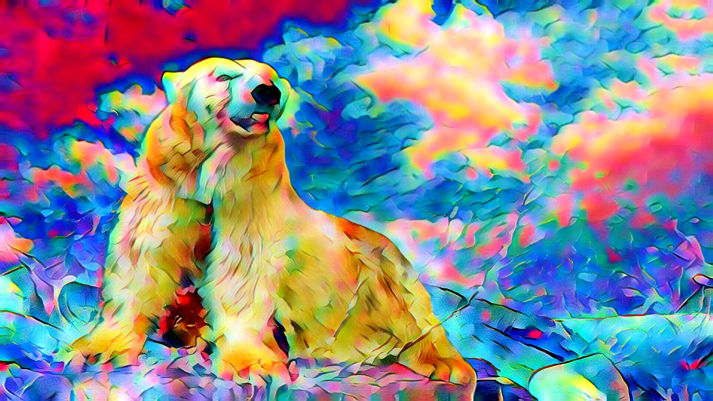
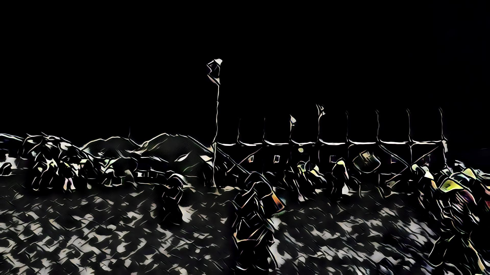
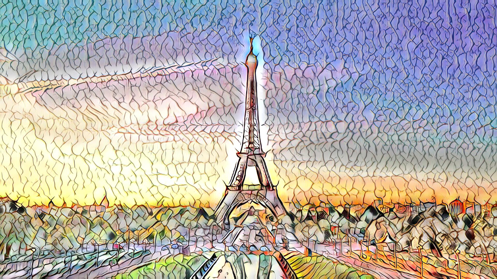

# Neural Style

**Example 1**
| Style |  |  |
| ----- | ----- | ----- |
|  |  |  |
|  |  |  |
|  |  |  |
|  |  |  |
|  |  |  |
|  |  |  |
|  |  |  |
|  |  |  |
|  |  |  |
|  |  |  |
|  |  |  |
|  |  |  |
|  |  |  |
|  |  |  |
|  |  |  |

**Example 2**
| Style |  |  |
| ----- | ----- | ----- |
|  |  |  |
|  |  |  |
|  |  |  |
|  |  |  |
|  |  |  |
|  |  |  |
|  |  |  |
|  |  |  |
|  |  |  |
|  |  |  |
|  |  |  |
|  |  |  |
|  |  |  |
|  |  |  |
|  |  |  |

**Example 3**
| Style |  |  |
| ----- | ----- | ----- |
|  |  |  |
|  |  |  |
|  |  |  |
|  |  |  |
|  |  |  |
|  |  |  |
|  |  |  |
|  |  |  |
|  |  |  |
|  |  |  |
|  |  |  |
|  |  |  |
|  |  |  |
|  |  |  |
|  |  |  |

**Example 4**
| Style |  |  |
| ----- | ----- | ----- |
|  |  |  |
|  |  |  |
|  |  |  |
|  |  |  |
|  |  |  |
|  |  |  |
|  |  |  |
|  |  |  |
|  |  |  |
|  |  |  |
|  |  |  |
|  |  |  |
|  |  |  |
|  |  |  |
|  |  |  |

**Example 5**
| Style |  |  |
| ----- | ----- | ----- |
|  |  |  |
|  |  |  |
|  |  |  |
|  |  |  |
|  |  |  |
|  |  |  |
|  |  |  |
|  |  |  |
|  |  |  |
|  |  |  |
|  |  |  |
|  |  |  |
|  |  |  |
|  |  |  |
|  |  |  |

**Example 6**
| Style |  |  |
| ----- | ----- | ----- |
|  |  |  |
|  |  |  |
|  |  |  |
|  |  |  |
|  |  |  |
|  |  |  |
|  |  |  |
|  |  |  |
|  |  |  |
|  |  |  |
|  |  |  |
|  |  |  |
|  |  |  |
|  |  |  |
|  |  |  |

## Train

`python train.py`

## Demo

`./demo.sh`

**Spend: 1080P/s.**

## Requirements

- Python 3.6.0

- PyTorch 0.4.0

- TorchVision 0.2.1

- Pillow 4.2.1

## References

1. X. Huang and S. Belongie. "Arbitrary Style Transfer in Real-time with Adaptive Instance Normalization.", in ICCV, 2017.
2. https://github.com/xunhuang1995/AdaIN-style
